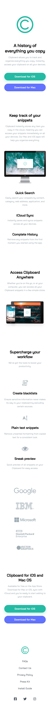

# Frontend Mentor - Clipboard landing page solution

This is a solution to the [Clipboard landing page challenge on Frontend Mentor](https://www.frontendmentor.io/challenges/clipboard-landing-page-5cc9bccd6c4c91111378ecb9). Frontend Mentor challenges help you improve your coding skills by building realistic projects. 

## Table of contents

- [Frontend Mentor - Clipboard landing page solution](#frontend-mentor---clipboard-landing-page-solution)
  - [Table of contents](#table-of-contents)
  - [Overview](#overview)
    - [The challenge](#the-challenge)
    - [Screenshots](#screenshots)
    - [Links](#links)
  - [My process](#my-process)
    - [Built with](#built-with)
  - [Author](#author)

## Overview

### The challenge

Users should be able to:

Users should be able to:

- View the optimal layout for the site depending on their device's screen size
- See hover states for all interactive elements on the page

### Screenshots
Desktop:

Mobile:

### Links

- Live Site URL: [click](https://borys25ol.github.io/frontend-mentor-challenges/clipboard-landing-page/)

## My process

### Built with

- Semantic HTML5 markup
- SCSS
- Flexbox
- FontAwesome
- Parcel
- Posthtml include
- Mobile-first workflow

## Author

- GitHub - [borys25ol](https://github.com/borys25ol)
- LinkedIn [Borys Oliinyk](https://www.linkedin.com/in/borys-oliinyk-872a73158/)
- Frontend Mentor - [@borys25ol](https://www.frontendmentor.io/profile/borys25ol)
